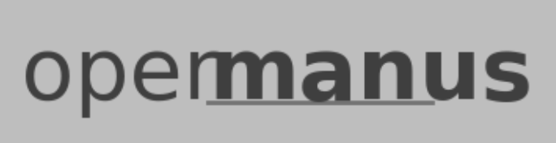

# OpenManus

<p align="center">
  
</p>


## Overview

OpenManus is an open-source project aimed at replicating the capabilities of the Manus AI agent, a groundbreaking general-purpose AI developed by Monica. Manus is known for its ability to autonomously execute complex tasks—ranging from personalized travel planning to stock analysis—surpassing models like GPT-4 on the GAIA benchmark. OpenManus seeks to bring these capabilities to the open-source community using a modular, containerized framework built with Docker, Python, and JavaScript.

This repository provides a starting point for developers and researchers to build, deploy, and experiment with a multi-agent AI system. Our goal is to create a flexible and extensible platform that mirrors Manus's autonomous task execution while fostering community contributions.

## Features

- **Multi-Agent System**: Collaborative AI agents working together to solve complex tasks.
- **Dockerized Environment**: Easy setup and deployment with containerization.
- **Task Execution**: Supports tasks like travel planning, data analysis, and content generation.
- **Tool Integration**: Web browsing, code execution, and data retrieval capabilities.
- **Modular Design**: Easily extendable with new agents, tools, or features.
- **Community-Driven**: Open to contributions and enhancements.

## Prerequisites

Before you begin, ensure you have the following installed:
- [Docker](https://docs.docker.com/get-docker/) (version 20.10 or higher)
- [Docker Compose](https://docs.docker.com/compose/install/) (version 1.29 or higher)
- [Python](https://www.python.org/downloads/) (3.9 or higher)
- [Node.js](https://nodejs.org/) (16.x or higher)
- Git (for cloning and contributing)

## Getting Started

### 1. Clone the Repository
```bash
git clone https://github.com/henryalps/OpenManus.git
cd OpenManus
```

### 2. Build and Run with Docker
```bash
# Build the Docker images
docker-compose build

# Start the services
docker-compose up
```

This will launch the core components:
- Agent Server: Handles task delegation and execution.
- Tool Layer: Provides web browsing, code execution, and data processing tools.
- Frontend: A basic interface for interacting with the agent (optional).

### 3. Test the System
Once running, you can interact with OpenManus via:
- CLI: Use the provided Python client (`python client.py`).
- API: Send requests to http://localhost:5000 (see API docs below).
- Web UI: Access http://localhost:3000 (if enabled).

Example CLI command:
```bash
python client.py --task "Plan a 3-day trip to Tokyo"
```

### Project Structure
```
OpenManus/
├── docker/               # Docker configurations and images
│   ├── agent/            # Dockerfile for the agent server
│   ├── tools/            # Dockerfile for tool integrations
│   └── frontend/         # Dockerfile for the web UI
├── src/                  # Source code
│   ├── agents/           # Multi-agent logic (Python)
│   ├── tools/            # Tool implementations (Python/JavaScript)
│   ├── client.py         # CLI client for testing
│   └── server.py         # Main API server
├── docs/                 # Documentation and API specs
├── docker-compose.yml    # Docker Compose configuration
└── README.md             # This file
```

### Configuration
Edit the `docker-compose.yml` file to customize:
- Ports (e.g., 5000 for API, 3000 for UI).
- Environment variables (e.g., API keys for external tools).
- Volume mounts for persistent data.

Example:
```yaml
services:
  agent:
    build: ./docker/agent
    ports:
      - "5000:5000"
    environment:
      - WEB_BROWSER_API_KEY=your_key_here
```

### API Documentation
The agent server exposes a REST API at http://localhost:5000. Key endpoints:

**POST /task**: Submit a task for execution.
```json
Body: { "task": "Analyze Tesla stock trends" }
Response: { "status": "success", "result": "..." }
```

**GET /status**: Check system health.
```json
Response: { "status": "running" }
```

Full API docs are available in `docs/api.md`.

### Contributing
We welcome contributions! To get started:
1. Fork the repository.
2. Create a feature branch (`git checkout -b feature/your-feature`).
3. Commit your changes (`git commit -m "Add your feature"`).
4. Push to your branch (`git push origin feature/your-feature`).
5. Open a Pull Request.

Please read `CONTRIBUTING.md` for guidelines.

### Roadmap
- Implement core multi-agent coordination.
- Add support for GAIA benchmark tasks.
- Integrate advanced NLP models (e.g., LLaMA, Grok).
- Enhance toolset with real-time web scraping and visualization.
- Release v1.0 with stable task execution.

### Inspiration
OpenManus is inspired by:
- The official Manus project (manus.im).
- The open-Manus community effort (GitHub).
- GAIA benchmark for general AI assistants (arXiv).

### License
This project is licensed under the MIT License. See `LICENSE` for details.

### Contact
For questions or collaboration, reach out via GitHub Issues or email [henryalps@gmail.com](mailto:henryalps@gmail.com).

Happy coding! Let's build the future of AI agents together!